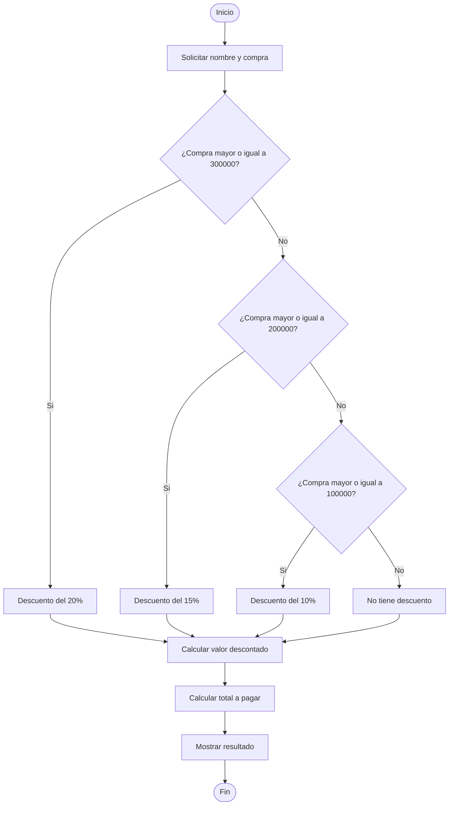

# Diagrama de flujo - Sistema Inteligente de Descuentos

```mermaid
flowchart TD

    A([Inicio]) --> B[Solicitar nombre y compra]

    B --> C{"¿Compra mayor o igual a 300000?"}

    C -->|Si| D["Descuento del 20%"]
    C -->|No| E{"¿Compra mayor o igual a 200000?"}

    E -->|Si| F["Descuento del 15%"]
    E -->|No| G{"¿Compra mayor o igual a 100000?"}

    G -->|Si| H["Descuento del 10%"]
    G -->|No| I["No tiene descuento"]

    D --> J["Calcular valor descontado"]
    F --> J
    H --> J
    I --> J

    J --> K["Calcular total a pagar"]
    K --> L["Mostrar resultado"]
    L --> M([Fin])
```
